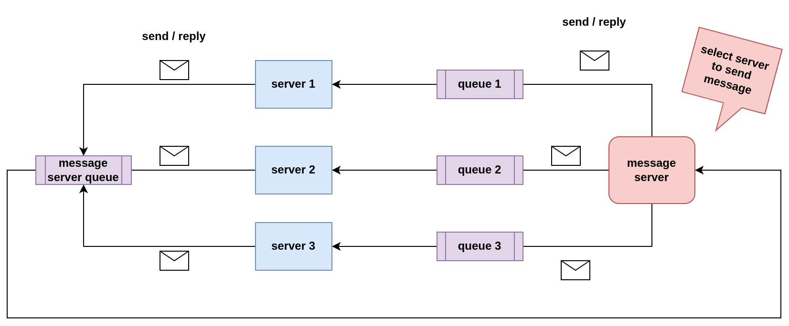

# celery-chat
- create a local database(postgresql)
- migrate database from worker codebase
- get local ip like 192.xxx.xxx.xxx
- update .env files with local
- install redis server (if local redis is used)
- enable redis remote connection
- sudo systemctl restart redis
- run docker-compose up

### Basic flow
